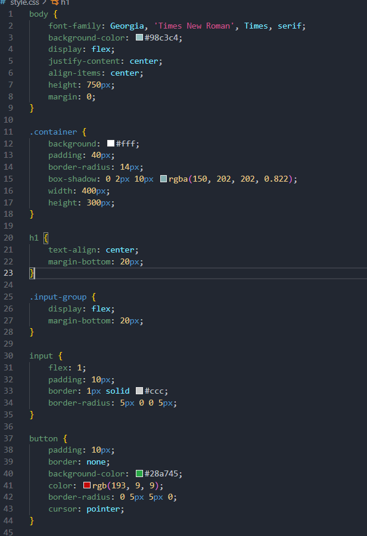

 # Task Tracker Application
   ## Overview
     The Task Tracker application is a simple tool designed to help users manage their daily tasks efficiently. It allows users to add, edit, delete, and view tasks in a clean and user-friendly interface. The application is built using vanilla JavaScript, HTML, and CSS, and can be easily run in any modern web browser.

   ## Features
 Add Task: Users can add new tasks to their task list by typing into the input field and clicking the "Add Task" button.

 Edit Task: Users can edit existing tasks by clicking the "Edit" button next to the task.

 Delete Task: Users can remove tasks from their list by clicking the "Delete" button next to the task.
  
 View Tasks: All tasks are displayed in a list format, showing the most recently added tasks at the top.
  # Setup Instructions
   ## Download the Project Files:
     Download the project files .
   ## Unzip the Files:
     If the project files are compressed in a .zip file, unzip them to a directory of your choice on your computer.
   ## Open the Project Directory:
   Navigate to the directory where you unzipped the files.
   ## Open the Application:
   Double-click the index.html file to open the application in your default web browser.
   # Usage
   Adding a Task:
Type your task into the input field and click the "Add Task" button.
   Editing a Task:
Click the "Edit" button next to the task you want to change. A prompt will appear allowing you to modify the task's text.
   Deleting a Task:
Click the "Delete" button next to the task you wish to remove from the list.
  Viewing Tasks:
All tasks are displayed in a list format, with the most recently added tasks appearing at the top.
 # Technologies Used
HTML: For structuring the webpage.
CSS: For styling the application.
JavaScript: For implementing the task management logic.
  # screenshorts
  
  
  
  
  # Conclusion
  This Task Tracker application serves as a basic demonstration of CRUD operations using vanilla JavaScript, HTML, and CSS. It is a lightweight and efficient tool for managing tasks and can be easily customized or expanded to include additional features.

